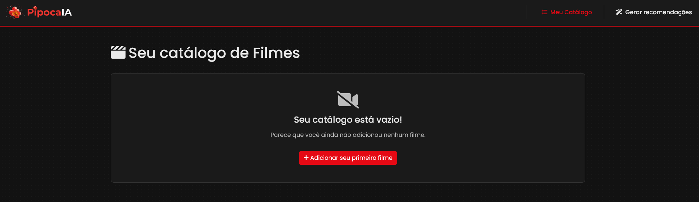
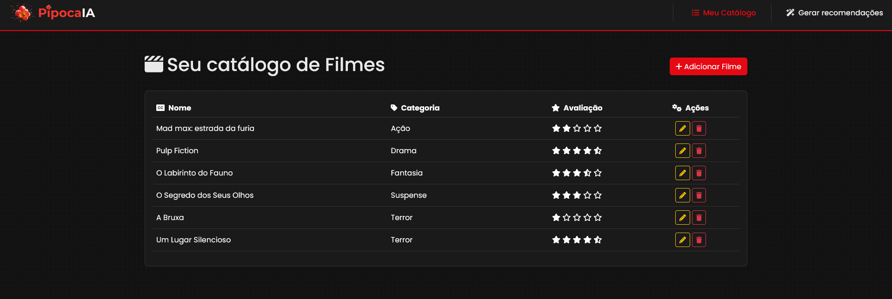
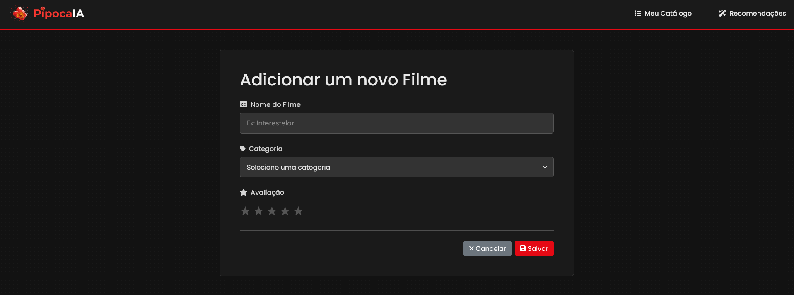
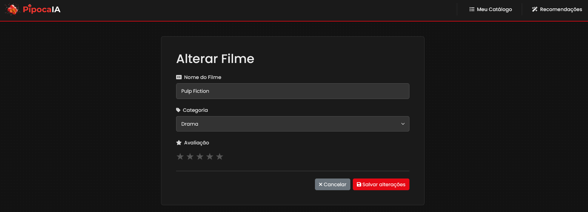
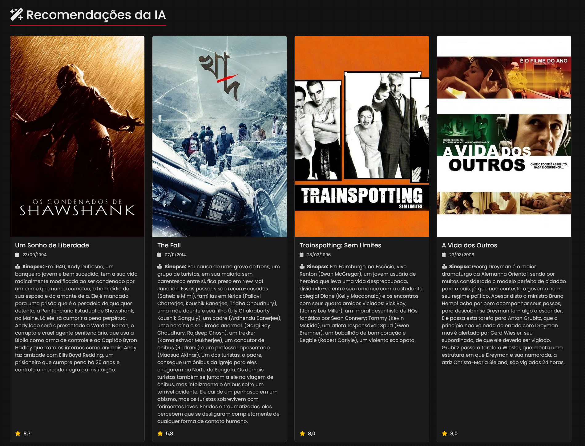

# PipocaIA - Sistema de recomendação de filmes com IA


[](https://openai.com/api/)
[](https://developer.themoviedb.org/docs)


Aplicação web full-stack que utiliza Inteligência Artificial para gerar recomendações de filmes personalizadas. O projeto foi desenvolvido como um estudo aprofundado em arquiteturas reativas no ecossistema Spring, demonstrando a orquestração de múltiplas APIs externas e a construção de uma interface de usuário dinâmica e interativa.

---

### 📸 Visão Geral da Interface

A aplicação conta com um dashboard limpo e moderno, com uma temática de cinema, que centraliza todas as funcionalidades, desde o catálogo de filmes do usuário até a exibição das recomendações.

#### **Dashboard do Catálogo Vazio (Estado Inicial):**
*Tela de boas-vindas amigável para novos usuários, guiando-os para a primeira ação e demonstrando a experiência inicial do aplicativo.*



#### **Dashboard do Catálogo Preenchido:**
*Tabela com todos os filmes avaliados pelo usuário, com funcionalidades completas de CRUD (Criar, Ler, Atualizar, Deletar).*



#### **Formulário de Adição/Alteração:**
*Formulários intuitivos para adicionar e alterar filmes no catálogo, com um seletor de avaliação de 5 estrelas.*




#### **Recomendações Geradas pela IA:**
*Grid responsivo com os filmes recomendados pela IA, enriquecidos com dados (pôster, sinopse, nota) obtidos da API da TMDb.*



---

## 📜 Descrição Completa

**PipocaIA** é um sistema inteligente que oferece recomendações de filmes baseadas nas avaliações prévias de um usuário. A aplicação permite o gerenciamento completo de um catálogo pessoal de filmes e, com base nesses dados, consome a API da OpenAI para gerar sugestões novas e criativas. Em seguida, orquestra uma segunda chamada à API da TMDb (The Movie Database) para enriquecer as sugestões com informações detalhadas, como pôsteres, sinopses e datas de lançamento.

O back-end foi construído com Spring WebFlux, utilizando o Project Reactor (Mono e Flux) para um processamento totalmente assíncrono e não-bloqueante. A interface de usuário foi renderizada no lado do servidor com Thymeleaf e estilizada com Bootstrap 5, proporcionando uma experiência de usuário moderna e responsiva. Para completar a arquitetura e garantir um ambiente de desenvolvimento robusto e portável, a aplicação foi totalmente containerizada com **Docker** e orquestrada com **Docker Compose**, permitindo que todo o sistema, incluindo a aplicação reativa e o banco de dados PostgreSQL, seja executado de forma isolada com um único comando.

---

### 🚀 Funcionalidades

- 🤖 **Recomendações com IA:** Integração com a API da OpenAI para gerar listas de filmes personalizadas.
- 🖼️ **Enriquecimento de Dados:** Consumo da API da TMDb para buscar detalhes e pôsteres dos filmes recomendados.
- 🚀 **Back-end Reativo:** Arquitetura 100% assíncrona com Spring WebFlux para alta performance.
- 🖥️ **Dashboard Interativo:** Interface web com Thymeleaf para visualização do catálogo.
- 📝 **CRUD Completo:** Funcionalidades para Adicionar, Listar, Alterar e Deletar filmes do catálogo pessoal.
- 🗄️ **Versionamento de Banco de Dados:** Uso do Flyway para gerenciar as migrações do esquema do banco.
- 📱 **Interface Responsiva:** Design construído com Bootstrap 5, adaptável a diferentes tamanhos de tela.

---

### 💪 Desafios Superados

Durante o desenvolvimento, vários desafios foram superados, servindo como grandes pontos de aprendizado:

- **Programação Reativa:** Aprendizado e aplicação aprofundada dos conceitos de **Mono e Flux** do Project Reactor para gerenciar o fluxo de dados assíncrono, especialmente na orquestração de múltiplas chamadas de API.
- **Orquestração de APIs Externas:** Implementação de uma cadeia de chamadas complexa: **Banco de Dados -> Serviço OpenAI -> Serviço TMDb**. O resultado de uma chamada servia como entrada para a próxima, exigindo um controle de fluxo reativo com operadores como **flatMap e concatMap**.
- **Rate Limiting:** Diagnóstico e solução de problemas de Rate Limiting (erro 522) de uma API externa, implementando estratégias como chamadas sequenciais (**concatMap**) e atrasos (**delayElements**) para garantir a estabilidade da aplicação.
- **Prompt Engineering:** Refinamento contínuo do prompt enviado à OpenAI para garantir que a resposta da IA viesse no formato exato esperado pela aplicação (uma lista de nomes de filmes, sem texto adicional), melhorando a robustez do parsing.
- **UI com Thymeleaf:** Implementação de componentes de UI complexos, como um seletor de avaliação de 5 estrelas e a renderização condicional de elementos com **th:if**.

---

### 🛠️ Tecnologias Utilizadas

- **Backend:**
    - Java 17+
    - Spring Boot 3.x
    - Spring WebFlux / Project Reactor
    - Spring Data JPA / Hibernate
- **Frontend:**
    - Thymeleaf
    - HTML5 / CSS3
    - Bootstrap 5
- **Banco de Dados:**
    - PostgreSQL
    - Flyway (para versionamento de schema)
- **Build & Dependências:**
    - Apache Maven
    - Lombok
    - MapStruct
-  **Integrações:**
    - OpenAI API
    - TMDb API
-  **DevOps:**
    - Docker   

---

## ⚙️ Instalação e Uso

### 🐳 Rodando com Docker (Método Recomendado)

Esta é a forma mais simples e rápida de executar o projeto, pois todo o ambiente (aplicação reativa + banco de dados
PostgreSQL) é gerenciado pelo Docker.

1. **Pré-requisitos:**

* Docker e Docker Compose instalados.
* Chaves de API para a OpenAI e a TMDb.

2. **Clone o repositório:**
   ```bash
   git clone [https://github.com/lucass-barreto/pipocaIA.git](https://github.com/lucass-barreto/pipocaIA.git)
   cd pipocaIA
   ```

3. **Configure as variáveis de ambiente:**
   Na raiz do projeto, crie um arquivo `.env` a partir do `.env.example`. Este arquivo deve conter as credenciais do
   banco de dados e suas chaves de API.
   ```bash
   cp .env.example .env
   ```
   *Em seguida, edite o arquivo `.env` e insira suas chaves da API da OpenAI e da TMDb nas variáveis correspondentes.*

4. **Suba o ambiente com Docker Compose:**
   Este comando irá construir a imagem da aplicação e iniciar os containers em segundo plano.
   ```bash
   docker-compose up --build -d
   ```

5. **Acesse a Aplicação:**
   Após alguns instantes, a aplicação estará disponível no seu navegador:

* **Dashboard (Catálogo):** [http://localhost:8080/pipocaIA/dashboard](http://localhost:8080/pipocaIA/dashboard)

### 🐋 Imagem no Docker Hub

Uma imagem pré-construída desta aplicação está disponível publicamente no Docker Hub. Você pode baixá-la diretamente com
o comando:

```bash
docker pull lucassbarreto/pipoca-ia-app:0.0.1-RELEASE
```

**Para mais detalhes, visite o repositório no [Docker Hub](https://hub.docker.com/r/lucassbarreto/pipocaia-app).**

## 📫 Contato

**Lucas Barreto Oliveira**

* **GitHub:** [@lucass-barreto](https://github.com/lucass-barreto)
* **LinkedIn:** [@lucass-barreto](https://www.linkedin.com/in/lucass-barreto)
* **Email:** lucasbo.dev@gmail.com
